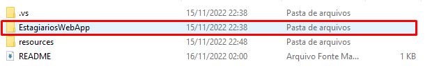

# <b>EstagiariosWebApp</b>

<h3 align="left">

Esse repositório tem duas aplicações. 

📝 <b>CadastroCLI</b> permite cadastrar e remover Estagiários e Setores de um local.

🌐 <b>EstagiariosWebApp</b> que permite visualizar os Estagiários cadastrados.

</h3>

# <b>Pré-Requisitos</b>

<h3 align="left">

Antes de começar, você vai precisar ter instalado em sua máquina as seguintes ferramentas:
[<b>Visual Studio 2022</b> (https://visualstudio.microsoft.com/pt-br/downloads/)] Com o <b>C#</b> e <b>.NET / ASP.NET</b> e as suas dependências.

# 🛠 <b>Tecnologias</b>

<h3 align="left">

As seguintes ferramentas foram utilizadas na construção do projeto:

- C#
- .NET Framework Core
- .ASP-Net

# ⚙ <b>Como executar o Projeto</b>

<h2 align="left">

<b> CadastroCLI </b>

<h2>

<h3 align="left"> Para executar a parte de cadastrar usuários é necessário abrir a pasta principal no <b> Visual Studio 2022 </b> 
